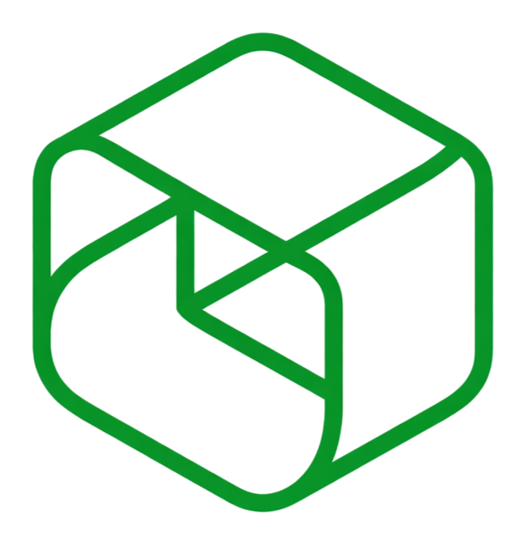
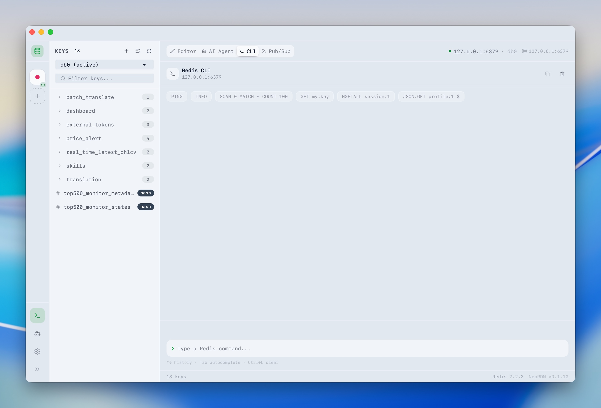

  

<h1 align="center">NeoRDM</h1>

  AI-first Redis desktop client. 
  Built for understanding data, exploring keys, and executing Redis workflows with confidence.

  English | <a href="./README.zh-CN.md">简体中文</a>

  

NeoRDM is a modern Redis desktop client with AI at the center of the workflow.  
It helps you inspect data faster, understand key structures, and turn natural language into Redis actions with safety checks built in.

## AI Highlights

- Context-aware AI assistant for the active connection, database, key, and value
- Natural-language to Redis command suggestions
- Key analysis, TTL explanation, and data-structure guidance
- Confirmation flow before executing write or dangerous commands
- OpenAI-compatible API support

## Core Features

- Multi-connection Redis management
- Tree-style key browser with search, grouping, and DB switching
- Value viewer/editor for `string`, `hash`, `list`, `set`, `zset`, `stream`, and `json`
- Built-in Redis CLI with history and dangerous-command confirmation
- Theme, language, privacy, and workspace preferences
